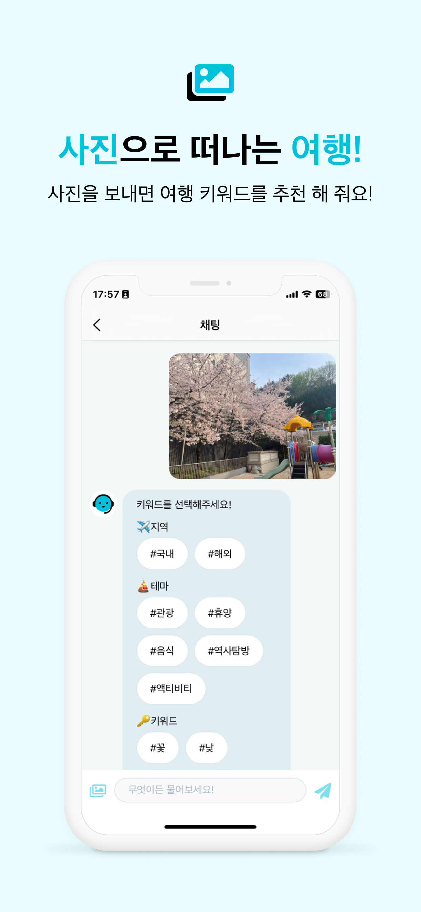
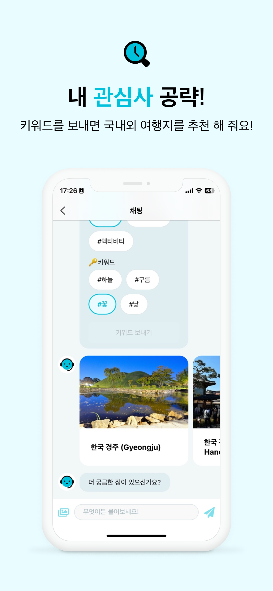
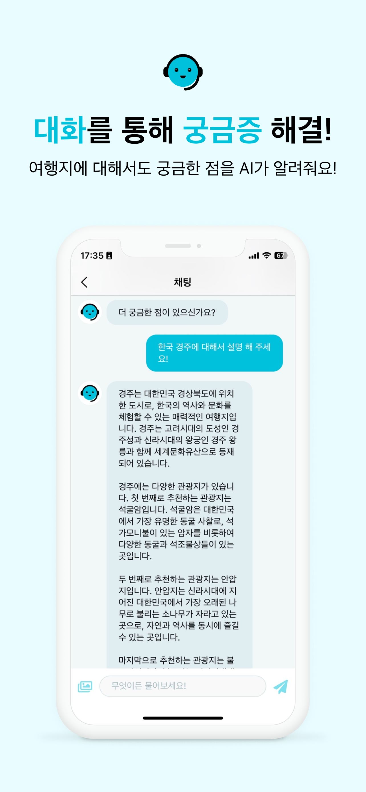

# 트립챗(TripChat)
> 사진을 보내주시면 비슷한 분위기의 여행지를 추천해 드려요!

1️⃣ 좋았던 여행지 사진이나, SNS를 하다가 우연히 보고 저장한 여행지 사진을 보내주세요. AI가 사진에서 키워드를 찾아 드립니다.  
2️⃣ 원하는 키워드를 선택하면 해당 키워드를 기반으로 새로운 여행지를 추천해 드립니다.  
3️⃣ 추천된 여행지에 대해 더 궁금하다면 AI에게 질문해보세요!  

### 프로젝트 기간
- 개발: 2023.07.22 ~
- 출시: 2023.10.10

| 기획 | 디자인 | AI | iOS | iOS |
|:-:|:-:|:-:|:-:|:-:|
| 아영 | 현 | 우란 | Woong | SummerCat |

## 🛠️ Skills
### 개발환경
<!--배지로 변경 가능한 것은 배지로 변경!-->

### 협업 툴

### Library

### API

### Architecture
- MVVM + Coordinator
- Clean Architecture

<!-- ## ⭐️ Feature -->
